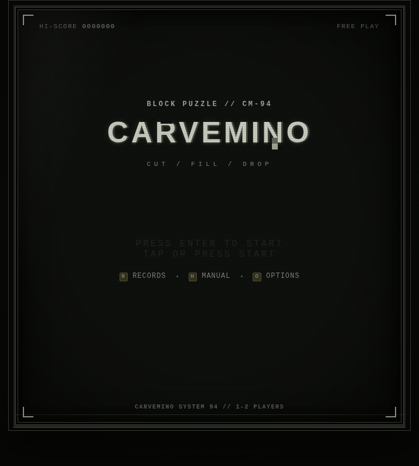
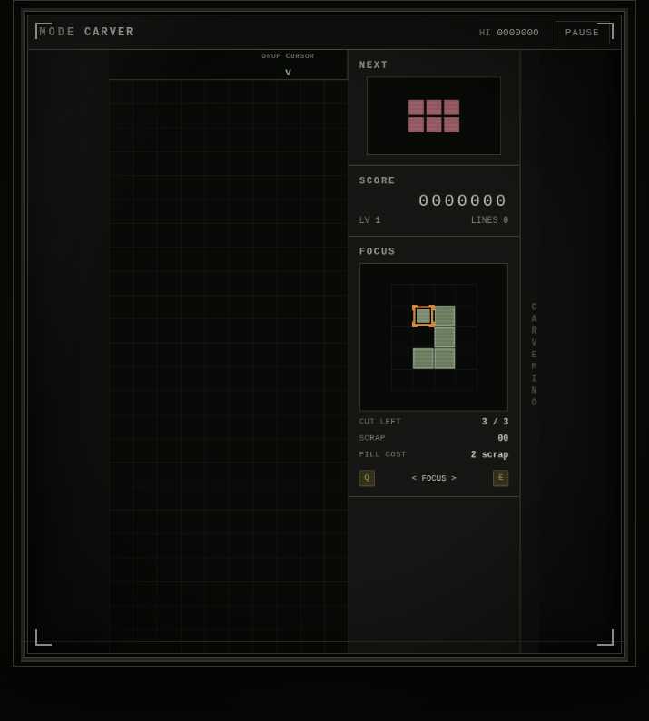
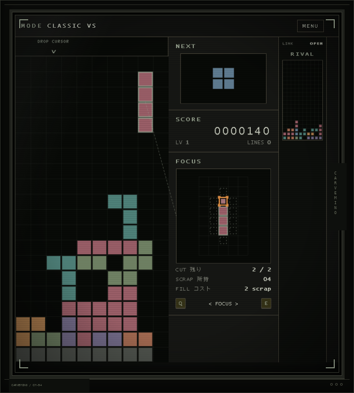

# Carvemino



### A block-stacking puzzle where the pieces choose where to fall - and you carve them into shape before they land.

Carvemino flips the usual falling-block formula. You do not steer pieces sideways or rotate them on demand; instead, you switch focus between active pieces and reshape them in real time. Cut cells away, collect **SCRAP**, spend it to fill new cells, and decide when to drop before the board gets away from you.

| Gameplay | Versus |
| --- | --- |
|  |  |

## Highlights

* **Sculpt instead of steer.** Remove cells from a falling piece, bank the material, then spend it to fill eligible neighboring cells.
* **Juggle multiple pieces.** Focus can move between pieces already in flight, turning each drop into a timing and prioritization problem.
* **Two distinct rulesets.** **Carver** uses larger polyominoes and a taller field; **Classic** brings familiar minoes with tighter carving limits.
* **Direct LAN versus.** Classic VS and Carver VS use WebRTC DataChannels, compact offer/answer codes, QR sharing, garbage attacks, and deterministic synchronization - no signaling backend required.
* **Arcade presentation with modern input.** CRT-inspired UI, keyboard rebinding, responsive touch/tablet controls, generated Web Audio music and SFX, local records and achievements, plus English/Japanese onboarding.

## Architecture

Carvemino is a no-build, vanilla HTML/CSS/JavaScript app. The simulation is kept separate from browser concerns so the same deterministic game state can drive solo play, tests, snapshots, and network matches.

```text
.
|- src/
|  |- adapters/          WebRTC transport boundary
|  |- app/               runtimes, protocol, profiles, mode catalogs, LAN sessions
|  |- audio/             Web Audio music and sound effects
|  |- domain/
|  |  |- game/           deterministic simulation, sculpting, drops, garbage, state
|  |  `- match/          versus/survival match policies
|  |- match-policies/    policy tuning presets
|  |- rulesets/          Carver and Classic gameplay configuration
|  `- ui/                screens, input, navigation, onboarding, QR UI
|- styles/
|  |- components/        shared UI pieces
|  |- controls/          touch and device-specific controls
|  `- screens/           screen-level presentation
`- tests/                domain, runtime, UI, protocol, audio, and networking tests
```

The core runs as a fixed-step deterministic simulation with seeded random streams, snapshot/restore support, and state hashing. Multiplayer layers a validated protocol and host-authoritative lockstep runtime on top rather than mixing networking into the game domain.

## Controls

| Action                       | Default         |
| ---------------------------- | --------------- |
| Select previous / next piece | `Q` / `E`       |
| Move sculpt cursor           | `W` `A` `S` `D` |
| Sculpt selected cell         | `Z` or `Enter`  |
| Hard-drop focused piece      | `Space`         |
| Pause / resume               | `Esc`           |

Touch controls expose the same core actions, and gameplay keybindings can be changed from **Options**.

## Run locally

Serve the repository over HTTP so browser ES modules load normally:

```sh
python3 -m http.server 8000
```

Then open `http://localhost:8000/`.

No package install is required. Node.js is only needed for the test runner:

```sh
npm test
```

The test suite covers deterministic gameplay, sculpting and drop rules, snapshots and hashing, match policies, LAN signaling and resynchronization, protocol validation, profile persistence, audio, responsive input, and UI behavior.

> **Multiplayer status:** direct LAN play is implemented; the Online menu entry is currently marked WIP.
